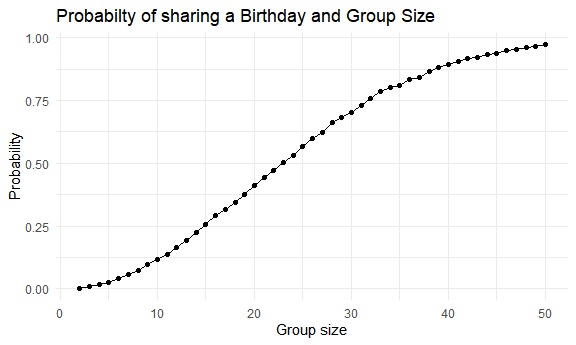
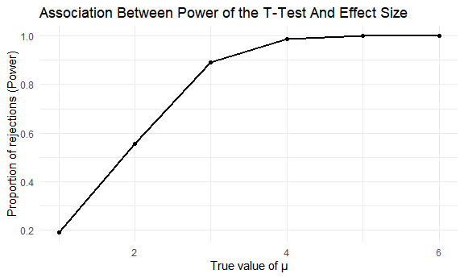
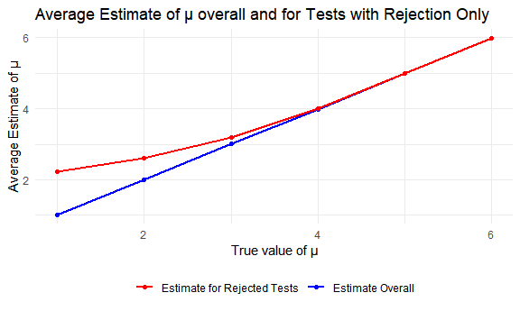
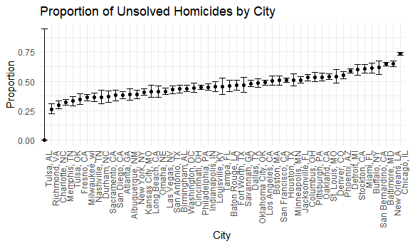

p8105_hw5_hp2661
================
Huizhong Peng
2024-11-15

### Problem 1

``` r
set.seed(123)

# function
sim_birthday = function(n){
  birthdays = sample(1:365, n, replace = TRUE)
  
  return(length(unique(birthdays)) < n)
}

# 10000 times
sim_birthday_df = 
  expand.grid(
    sample_size = 2:50,
    iter = 1:10000
  ) |> 
  mutate(
    estimate_df = map(sample_size, sim_birthday)
  ) |> 
  unnest(estimate_df)

prob_df = 
  sim_birthday_df |> 
  group_by(sample_size) |> 
  summarize(
    prob = mean(estimate_df)
  )

# plot
ggplot(prob_df, aes(x = sample_size, y = prob)) +
  geom_point() +
  geom_line() +
  labs(
    title = "Probabilty of sharing a Birthday and Group Size",
    x = "Group size",
    y = "Probability"
  )
```



There is a positive association between the probability that at least
two people in the group will share a birthday and the group size.

### Problem 2

``` r
set.seed(123)

# calculate power
my_power = function(mu_0, n = 30, sigma = 5) {
  x = rnorm(n, mean = mu_0, sd = sigma)

  t_result = t.test(x, mu = 0) |> broom::tidy()
  
  tibble(
    estimate = t_result$estimate,
    p_value = t_result$p.value
  )
}

# for mu list
sim_powers_df = function(mu_list, iteration = 5000){
  expand_grid(
    mu = mu_list,
    iter = 1:iteration
  ) |> 
  mutate(
    estimate_df = map(mu, my_power)
  ) |> 
  unnest(estimate_df)
}

# result
mu_list = 0:6
sim_results_df = sim_powers_df(mu_list)

sim_results_plot = sim_results_df |> 
  mutate(
    rej = ifelse(p_value < .05, 1, 0)
  )
```

``` r
sim_results_plot1 = sim_results_plot |> 
  group_by(mu) |> 
  summarize(
    rej_rate = mean(rej),
    avg_estimate = mean(estimate),
    avg_estimate_rej = mean(estimate[rej == 1])
  ) |> 
  filter(mu != 0)

# plot 1
plot1 = 
  ggplot(sim_results_plot1, aes(x = mu, y = rej_rate)) +
  geom_line(size = 1) +
  geom_point() +
  labs(
    title = "Association Between Power of the T-Test And Effect Size",
    x = "True value of μ",
    y = "Proportion of rejections (Power)"
  )

plot1
```



Plot 1 suggests that the proportion of times the null was rejected
increases with increasing effect size. They are positive associated and
the power is equal to 1 after \$ = 5\$.

``` r
# plot 2
plot2 = 
  ggplot(sim_results_plot1, aes(x = mu)) +
  geom_line(aes(y = avg_estimate, color = "Estimate Overall"), size = 1) +
  geom_point(aes(y = avg_estimate, color = "Estimate Overall")) +
  geom_line(aes(y = avg_estimate_rej, color = "Estimate for Rejected Tests"), size = 1) +
  geom_point(aes(y = avg_estimate_rej, color = "Estimate for Rejected Tests")) +
  scale_color_manual(
    values = c("Estimate Overall" = "blue", "Estimate for Rejected Tests" = "red")
  ) +
  labs(
    title = "Average Estimate of μ overall and for Tests with Rejection Only",
    x = "True value of μ",
    y = "Average Estimate of μ"
  ) +
  theme(legend.title = element_blank())

plot2
```



Plot 2 suggests that the sample average of \$ \$ across tests with
rejection and the true value of \$ \$ are not equal, because the sample
mean is significantly different from 0 in the null hypothesis, and then
the p-value \< .05.

``` r
write.csv(sim_results_plot, "data/p2_sim_results.csv", row.names = FALSE)
ggsave("data/plot1.png", plot = plot1)
ggsave("data/plot2.png", plot = plot2)
```

### Problem 3

``` r
url = "https://raw.githubusercontent.com/washingtonpost/data-homicides/refs/heads/master/homicide-data.csv"
raw_dat = read_csv(url, na = c("Unknown", ""))

skimr::skim(raw_dat)
```

|                                                  |         |
|:-------------------------------------------------|:--------|
| Name                                             | raw_dat |
| Number of rows                                   | 52179   |
| Number of columns                                | 12      |
| \_\_\_\_\_\_\_\_\_\_\_\_\_\_\_\_\_\_\_\_\_\_\_   |         |
| Column type frequency:                           |         |
| character                                        | 8       |
| numeric                                          | 4       |
| \_\_\_\_\_\_\_\_\_\_\_\_\_\_\_\_\_\_\_\_\_\_\_\_ |         |
| Group variables                                  | None    |

Data summary

**Variable type: character**

| skim_variable | n_missing | complete_rate | min | max | empty | n_unique | whitespace |
|:--------------|----------:|--------------:|----:|----:|------:|---------:|-----------:|
| uid           |         0 |          1.00 |   9 |  10 |     0 |    52179 |          0 |
| victim_last   |      5764 |          0.89 |   1 |  20 |     0 |    12686 |          0 |
| victim_first  |      5762 |          0.89 |   1 |  28 |     0 |    16639 |          0 |
| victim_race   |      4199 |          0.92 |   5 |   8 |     0 |        5 |          0 |
| victim_sex    |      4231 |          0.92 |   4 |   6 |     0 |        2 |          0 |
| city          |         0 |          1.00 |   5 |  14 |     0 |       50 |          0 |
| state         |         0 |          1.00 |   2 |   2 |     0 |       28 |          0 |
| disposition   |         0 |          1.00 |  14 |  21 |     0 |        3 |          0 |

**Variable type: numeric**

| skim_variable | n_missing | complete_rate |        mean |         sd |          p0 |         p25 |         p50 |         p75 |          p100 | hist  |
|:--------------|----------:|--------------:|------------:|-----------:|------------:|------------:|------------:|------------:|--------------:|:------|
| reported_date |         0 |          1.00 | 20130899.16 | 1123419.63 | 20070101.00 | 20100318.00 | 20121216.00 | 20150911.00 | 201511105\.00 | ▇▁▁▁▁ |
| victim_age    |      2999 |          0.94 |       31.80 |      14.42 |        0.00 |       22.00 |       28.00 |       40.00 |        102.00 | ▃▇▃▁▁ |
| lat           |        60 |          1.00 |       37.03 |       4.35 |       25.73 |       33.77 |       38.52 |       40.03 |         45.05 | ▁▅▅▇▅ |
| lon           |        60 |          1.00 |      -91.47 |      13.75 |     -122.51 |      -96.00 |      -87.71 |      -81.76 |        -71.01 | ▃▁▃▇▅ |

There are 52179 observations and 12 variables in the dataset, including
8 character variables (e.g., city, state, disposition) and 4 numeric
variables (e.g., victim_age, lat).

``` r
dat = raw_dat |> 
  janitor::clean_names() |> 
  mutate(
    city_state = paste(city, state, sep = ", ")
  )

summary = dat |> 
  group_by(city_state) |> 
  summarize(
    homicides = n(),
    homicides_unsolved = sum(disposition %in% c("Closed without arrest", "Open/No arrest"), na.rm = TRUE)
  )

summary
## # A tibble: 51 × 3
##    city_state      homicides homicides_unsolved
##    <chr>               <int>              <int>
##  1 Albuquerque, NM       378                146
##  2 Atlanta, GA           973                373
##  3 Baltimore, MD        2827               1825
##  4 Baton Rouge, LA       424                196
##  5 Birmingham, AL        800                347
##  6 Boston, MA            614                310
##  7 Buffalo, NY           521                319
##  8 Charlotte, NC         687                206
##  9 Chicago, IL          5535               4073
## 10 Cincinnati, OH        694                309
## # ℹ 41 more rows
```

``` r
# Baltimore, MD
baltimore_summary = summary |> 
  filter(city_state == "Baltimore, MD")

baltimore_test =
  prop.test(
  x = baltimore_summary |> pull(homicides_unsolved),
  n = baltimore_summary |> pull(homicides)
)

baltimore_results = broom::tidy(baltimore_test)
baltimore_estimates = baltimore_results |> 
  select(estimate, conf.low, conf.high)

baltimore_estimates
## # A tibble: 1 × 3
##   estimate conf.low conf.high
##      <dbl>    <dbl>     <dbl>
## 1    0.646    0.628     0.663
```

``` r
# Each city
summary_nest = nest(summary, data = homicides:homicides_unsolved)

my_prop_test = function(df) {
  test_result = prop.test(x = df$homicides_unsolved, n = df$homicides)
  test_result = test_result |> 
    broom::tidy() |> 
    select(estimate, conf.low, conf.high)
} 

city_summary = summary_nest |> 
  mutate(
    results = map(data, my_prop_test)
  ) |> 
  unnest()

city_summary
## # A tibble: 51 × 6
##    city_state      homicides homicides_unsolved estimate conf.low conf.high
##    <chr>               <int>              <int>    <dbl>    <dbl>     <dbl>
##  1 Albuquerque, NM       378                146    0.386    0.337     0.438
##  2 Atlanta, GA           973                373    0.383    0.353     0.415
##  3 Baltimore, MD        2827               1825    0.646    0.628     0.663
##  4 Baton Rouge, LA       424                196    0.462    0.414     0.511
##  5 Birmingham, AL        800                347    0.434    0.399     0.469
##  6 Boston, MA            614                310    0.505    0.465     0.545
##  7 Buffalo, NY           521                319    0.612    0.569     0.654
##  8 Charlotte, NC         687                206    0.300    0.266     0.336
##  9 Chicago, IL          5535               4073    0.736    0.724     0.747
## 10 Cincinnati, OH        694                309    0.445    0.408     0.483
## # ℹ 41 more rows
```

``` r
plot3 = 
  ggplot(city_summary, aes(x = fct_reorder(city_state, estimate), y = estimate)) +
  geom_point() +
  geom_errorbar(aes(ymin = conf.low, ymax = conf.high)) +
  labs(
    title = "Proportion of Unsolved Homicides by City",
    x = "City",
    y = "Proportion"
  ) +
  theme(
    axis.text.x = element_text(angle = 90, hjust = 1)
  )

plot3
```



``` r
write.csv(summary, "data/homicide_summary.csv", row.names = FALSE)
ggsave("data/plot3.png", plot = plot3)
```
